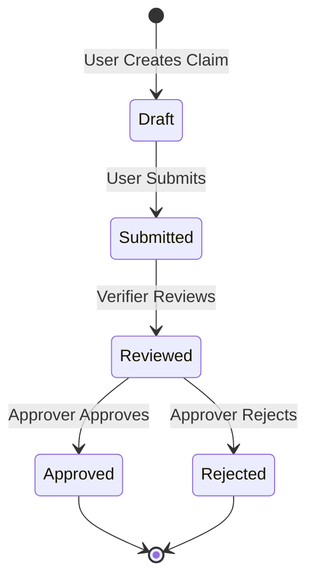
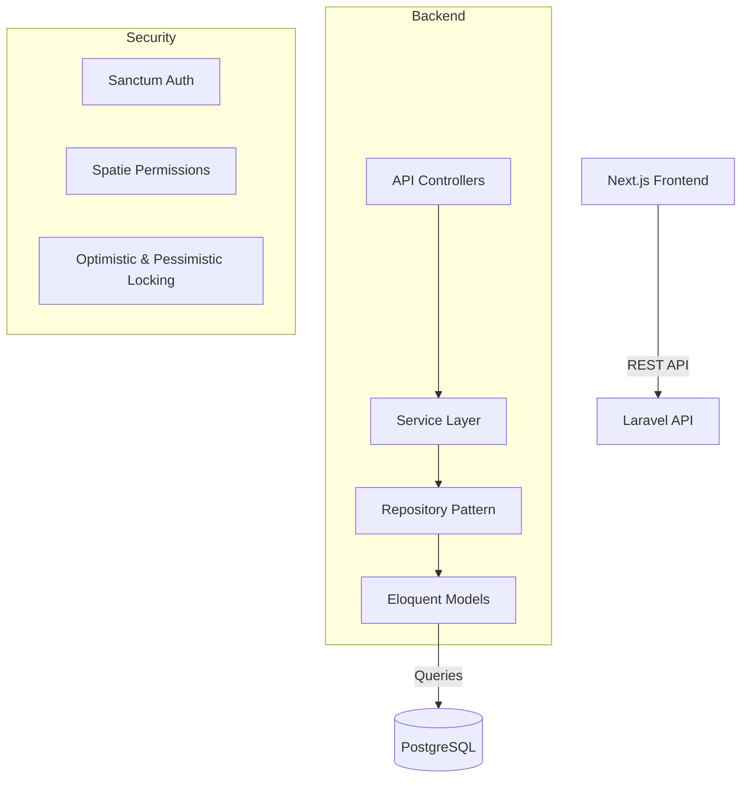

# Insurance Claim Approval System

This is a production-ready web application for PT AQ Business Consulting Indonesia to handle internal insurance claim workflows.

## Technology Stack

### Backend
- **Framework**: Laravel 12 (PHP 8.4+)
- **Database**: PostgreSQL
- **Architecture**: Repository Pattern, Service Layer
- **Features**: Database Transactions, Pessimistic & Optimistic Locking, Audit Trails

### Frontend
- **Framework**: Next.js 15 (App Router)
- **Language**: TypeScript
- **Styling**: TailwindCSS, Shadcn UI
- **State Management**: Zustand, TanStack Query

## Workflow Architecture

The application implements a multi-tier approval workflow with strict state transitions and race condition protection.



## System Architecture



## Running the Application

This project includes a fully configured Docker setup.

```bash
# Start all services (Backend, Frontend, PostgreSQL)
docker-compose up -d --build

# Run backend migrations and seeders (demo accounts)
docker-compose exec backend php artisan migrate --seed
```

### Demo Accounts
- **Requester**: user@example.com / password
- **Verifier**: verifier@example.com / password
- **Approver**: approver@example.com / password

## Key Features Implemented
- **Concurrency Control**: 
  - `SELECT FOR UPDATE` is used to prevent duplicate claim numbers during concurrent creation.
  - Optimistic locking (using a `version` field) prevents race conditions during status updates by concurrent users.
- **Audit Logging**: Every status transition automatically triggers an event (`ClaimStatusChanged`) which creates an immutable record in the `claim_activity_logs` table.
- **Security**: Sanctum API Tokens, Role-based Access Control (Spatie Permission), Policy Gates.
