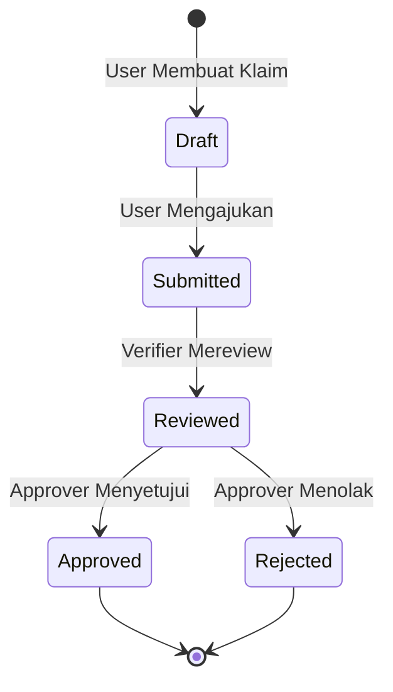
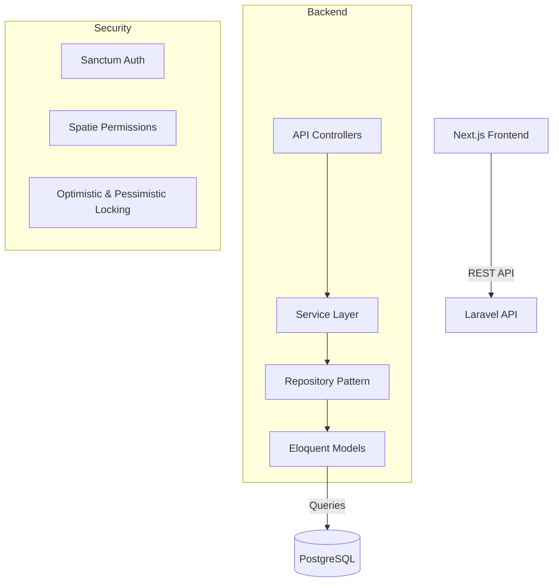

# Sistem Persetujuan Klaim Asuransi

Ini adalah aplikasi web siap produksi (production-ready) untuk PT AQ Business Consulting Indonesia yang dirancang untuk menangani alur kerja persetujuan klaim asuransi internal.

**🔗 Repository:** [https://github.com/Nk121212/claim-insurance-approval.git](https://github.com/Nk121212/claim-insurance-approval.git)

## Teknologi yang Digunakan

### Backend
- **Framework**: Laravel 12 (PHP 8.4+)
- **Database**: PostgreSQL
- **Arsitektur**: Repository Pattern, Service Layer
- **Fitur**: Database Transactions, Pessimistic & Optimistic Locking, Audit Trails

### Frontend
- **Framework**: Next.js 15 (App Router)
- **Bahasa**: TypeScript
- **Styling**: TailwindCSS, Shadcn UI
- **State Management**: Zustand, TanStack Query

## Arsitektur Alur Kerja (Workflow)

Aplikasi ini menerapkan alur kerja persetujuan bertingkat dengan transisi status yang ketat dan perlindungan dari *race condition* (konflik data).



## Arsitektur Sistem



## Menjalankan Aplikasi

Aplikasi ini dapat dijalankan menggunakan **Docker** (Sangat Direkomendasikan) atau **Local Environment** secara manual.

### Opsi 1: Menggunakan Docker (Direkomendasikan)

Cara termudah untuk menjalankan aplikasi beserta seluruh *database* tanpa perlu mengonfigurasi PC lokal Anda.

```bash
# Jalankan semua services (Backend, Frontend, PostgreSQL) di latar belakang
docker-compose up -d --build

# Jalankan migrasi dan seeder untuk membuat akun demo
docker-compose exec backend php artisan migrate --seed
```

### Opsi 2: Menggunakan Local Environment (Tanpa Docker)

Jika Anda ingin menjalankan proyek secara *native* di laptop Anda (membutuhkan PHP 8.4+, Node.js 20+, Composer, dan PostgreSQL yang sudah terinstal di sistem Anda).

#### A. Kondisi Pertama Kali Install (First-time Setup)

**1. Setup Database (PostgreSQL)**
- Pastikan service PostgreSQL Anda sedang berjalan.
- Buka tools database Anda (Navicat/pgAdmin/DBeaver) dan buat database kosong baru dengan nama `approval_system`.

**2. Setup Backend (Laravel)**
Buka terminal baru, lalu masuk ke folder direktori `backend`:
```bash
cd backend
composer install
cp .env.example .env
php artisan key:generate
```
Buka file `backend/.env` dan ubah konfigurasi database Anda sesuai kredensial lokal PostgreSQL Anda, contoh:
```ini
DB_CONNECTION=pgsql
DB_HOST=127.0.0.1
DB_PORT=5432
DB_DATABASE=approval_system
DB_USERNAME=[username_anda]  # Sesuaikan dengan user PostgreSQL lokal Anda
DB_PASSWORD=[password_anda]  # Sesuaikan dengan password lokal Anda
```
Jalankan migrasi dan buat akun demo, lalu jalankan server:
```bash
php artisan migrate --seed
php artisan serve
```
*Backend API Anda sekarang berjalan di `http://127.0.0.1:8000`*

**3. Setup Frontend (Next.js)**
Buka terminal baru (biarkan terminal backend tetap berjalan), lalu masuk ke folder direktori `frontend`:
```bash
cd frontend
npm install
```
Buat file baru bernama `.env` di dalam folder `frontend`, dan isi dengan URL API lokal backend Anda:
```ini
NEXT_PUBLIC_API_URL=http://127.0.0.1:8000
```
Lalu jalankan server frontend:
```bash
npm run dev
```
*Frontend Web Anda sekarang berjalan di `http://localhost:3000`*

#### B. Jika Sudah Pernah Diinstall (Daily Usage)

Jika Anda sudah pernah melakukan instalasi dan setup awal sebelumnya, Anda hanya perlu menjalankan *server development* secara bersamaan:

**Terminal 1 (Jalankan Backend):**
```bash
cd backend
php artisan serve
```

**Terminal 2 (Jalankan Frontend):**
```bash
cd frontend
npm run dev
```
*(Jangan lupa pastikan service PostgreSQL lokal Anda juga sudah dinyalakan)*

### Akun Demo
- **Pemohon (User)**: user@example.com / password
- **Verifier (Pemeriksa)**: verifier@example.com / password
- **Approver (Penyetuju)**: approver@example.com / password

## Pengujian Otomatis (Automated Testing)

Aplikasi ini telah dilengkapi dengan *unit* dan *feature testing*, termasuk tes khusus yang mensimulasikan penanganan **Race Condition** secara ketat.
Untuk menjalankan seluruh test pada *backend*, jalankan:
```bash
cd backend
php artisan test
```

## Fitur Utama yang Diimplementasikan
- **Concurrency Control (Kontrol Konkurensi)**: 
  - Penggunaan `SELECT FOR UPDATE` (*Pessimistic Locking*) untuk mencegah duplikasi Nomor Klaim saat banyak user membuat klaim dalam waktu yang persis bersamaan.
  - *Optimistic Locking* (menggunakan field `version`) untuk mencegah *race condition* atau penumpukan update status ketika ada dua user mencoba merubah status klaim di waktu yang sama.
- **Audit Logging (Riwayat Aktivitas)**: Setiap perubahan status akan memicu *event listener* (`ClaimStatusChanged`) secara otomatis yang akan mencatat riwayat permanen ke dalam tabel `claim_activity_logs` beserta nama pelakunya.
- **Security & Authorization**: Proteksi autentikasi API menggunakan Sanctum, dan kontrol hak akses halaman serta endpoint berdasarkan peran (Role-based Access Control via Spatie Permission dan Laravel Policy Gates).
